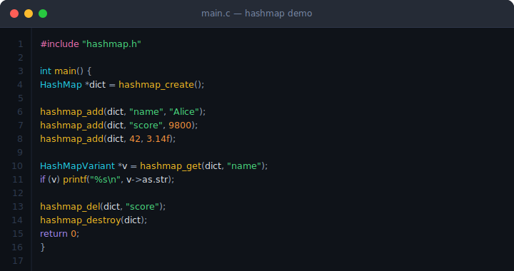
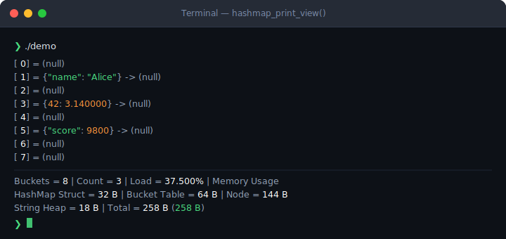
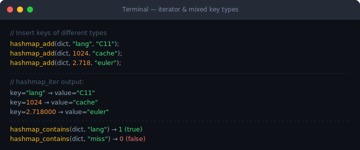

<div align="center">

# HashMap.c

**A type-safe, generic hash table for C11**  
**为 C11 打造的类型安全通用哈希表**

[](LICENSE)
[]()
[]()

</div>

---

## English

### Overview

`HashMap.c` is a zero-dependency, generic hash table implemented in C11. It supports mixed-type keys and values — integers, floats, strings, and raw pointers — through a tagged-union variant type (`HashMapVariant`). The public API is entirely macro-driven, so type dispatch happens at compile time via `_Generic`.

**Key properties:**

- **FNV-1a 64-bit hashing** with a runtime random seed (seeded from `time(NULL) ^ ptr`)
- **Separate chaining** via singly-linked lists; uses the Linus Torvalds double-pointer technique for O(1) node removal
- **Auto-resize**: expands when load > 0.75, shrinks when load < 0.25; bucket count is always a power of two
- **Edge-case safe**: handles `NaN` float equality, `-0.0f` hash normalization, NULL pointer keys, and `uint64_t` overflow in bucket sizing
- **Built-in diagnostics**: `hashmap_print_view()` prints the full bucket table with per-entry memory accounting

---

### Screenshots

#### Basic Usage · 基本用法


#### `hashmap_print_view()` Output


#### Iterator & Mixed Key Types · 迭代器与混合键类型


---

### Requirements

| Item | Requirement |
|------|-------------|
| C Standard | C11 or later (`-std=c11`) |
| Compiler | GCC, Clang, MSVC (C11 mode) |
| Dependencies | None (stdlib: `stdio.h`, `stdlib.h`, `string.h`, `time.h`) |
| Platform | Linux, macOS, Windows |

---

### Installation

No package manager, no build system. Just copy three files:

```
your_project/
├── src/
│   ├── hashmap.h     ← API, macros, inline helpers
│   └── hashmap.c     ← implementation
└── main.c
```

**Compile:**

```bash
gcc -std=c11 -O2 main.c hashmap.c -o app
```

---

### Quick Start

```c
#include "hashmap.h"

int main() {
    // 1. Create
    HashMap *dict = hashmap_create();

    // 2. Insert — any type as key or value
    hashmap_add(dict, "name",  "Alice");
    hashmap_add(dict, "score", 9800);
    hashmap_add(dict, 42,      3.14f);

    // 3. Get
    HashMapVariant *v = hashmap_get(dict, "name");
    if (v && v->type == _HASHMAP_STRING)
        printf("name = %s\n", v->as.str);   // name = Alice

    // 4. Check existence
    if (hashmap_contains(dict, "score"))
        puts("score exists");

    // 5. Update (just add again with the same key)
    hashmap_add(dict, "score", 10000);

    // 6. Delete
    hashmap_del(dict, 42);

    // 7. Iterate
    HashMapVariant *k, *val;
    hashmap_iter(dict, k, val) {
        hashmap_print_variant(k);
        printf(" → ");
        hashmap_print_variant(val);
        printf("\n");
    }

    // 8. Inspect structure & memory
    hashmap_print_view(dict);

    // 9. Destroy
    hashmap_destroy(dict);
    return 0;
}
```

---

### API Reference

All user-facing operations are macros that dispatch to typed internal functions at compile time.

| Macro | Signature | Returns | Description |
|-------|-----------|---------|-------------|
| `hashmap_create()` | `→ HashMap *` | pointer / NULL | Allocate and initialize a new HashMap (8 buckets, random seed) |
| `hashmap_destroy(dict)` | `HashMap *` | void | Free all nodes, bucket table, and the struct |
| `hashmap_add(dict, key, val)` | key/val: any supported type | `bool` | Insert or update a key-value pair |
| `hashmap_get(dict, key)` | key: any supported type | `HashMapVariant *` / NULL | Look up a value by key |
| `hashmap_del(dict, key)` | key: any supported type | `bool` | Remove a key-value pair |
| `hashmap_contains(dict, key)` | key: any supported type | `bool` | Check if a key exists |
| `hashmap_iter(dict, k, v)` | `k`, `v`: `HashMapVariant *` | — | Iterate all entries (for-loop macro) |
| `hashmap_clear(dict)` | `HashMap *` | void | Remove all entries and reset to 8 buckets |
| `hashmap_count(dict)` | `HashMap *` | `uint64` | Number of entries |
| `hashmap_print_view(dict)` | `HashMap *` | void | Print bucket table + memory stats |
| `hashmap_print_variant(x)` | `HashMapVariant *` | void | Print a single variant value |

**Supported key/value types:**

| C type | Internal tag |
|--------|-------------|
| `int`, `short`, `char` | `_HASHMAP_INT32` |
| `long long` | `_HASHMAP_INT64` |
| `unsigned int` | `_HASHMAP_UINT32` |
| `unsigned long long` | `_HASHMAP_UINT64` |
| `float` | `_HASHMAP_FLOAT` |
| `double` | `_HASHMAP_DOUBLE` |
| `char *` / `const char *` | `_HASHMAP_STRING` |
| `void *` / `const void *` | `_HASHMAP_POINTER` |

> **Note on `_HASHMAP_POINTER`:** the HashMap stores only the pointer value, not a copy of the heap it points to. Ownership of that memory remains with the caller — you must free it before calling `hashmap_clear` or `hashmap_destroy` to avoid leaks.

---

### How It Works

```
hashmap_add(dict, "hello", 42)
         │
         ▼ _Generic dispatch (compile-time)
         │
         ▼ __hashmap_hash__("hello", seed)
         │     └─ FNV-1a 64-bit over UTF-8 bytes
         │
         ▼ idx = hash & (bucket - 1)   ← power-of-2 fast modulo
         │
         ▼ Walk chain at table[idx]
               ├─ key found  → update value in-place
               └─ key absent → prepend new node
                                   └─ if load > 0.75 → resize × 2
```

**Resize** rehashes all existing nodes by re-computing `hash & (new_bucket - 1)` in-place — no re-hashing of keys, because `hash` is stored on each node.

---

### Memory Layout

```
HashMap (32 B)
├── seed    : uint64   — per-instance random seed
├── count   : uint64   — number of live entries
├── bucket  : uint64   — current bucket count (power of 2)
└── table   : **node   ─────────────────────────────────┐
                                                         │
table[0] → NULL                                          │
table[1] → _HashMapNode ──► _HashMapNode ──► NULL        │
             ├── hash  : uint64  (cached)                │
             ├── key   : HashMapVariant                  │
             └── value : HashMapVariant                  │
                   ├── type : enum (1 byte + padding)    │
                   └── as   : union { i32, i64, f32, … } │
                                                    ◄────┘
```

---

### License

MIT © see [LICENSE](LICENSE)

---
---

## 中文文档

### 概述

`HashMap.c` 是一个零依赖、基于 C11 标准实现的通用哈希表。通过标签联合变体类型（`HashMapVariant`）支持混合类型的键与值——整数、浮点、字符串、裸指针。公开 API 全部以宏驱动，类型分发在编译期通过 `_Generic` 完成，运行时无额外开销。

**核心特性：**

- **FNV-1a 64 位哈希**，结合运行时随机种子（`time(NULL) ^ 指针值` 生成）
- **分离链接法**，使用单向链表；采用 Linus Torvalds 双指针技巧实现 O(1) 节点删除
- **自动扩缩容**：负载超过 0.75 时扩容 ×2，低于 0.25 时缩容 ÷2；桶数量始终保持 2 的幂次
- **边界情况处理**：正确处理 NaN 浮点相等性、`-0.0f` 哈希规范化、NULL 指针键及桶计数 `uint64_t` 溢出
- **内置诊断工具**：`hashmap_print_view()` 打印完整桶表及逐条目内存统计

---

### 截图展示

#### 基本用法


#### `hashmap_print_view()` 输出


#### 迭代器与混合键类型


---

### 环境要求

| 项目 | 要求 |
|------|------|
| C 标准 | C11 及以上（`-std=c11`） |
| 编译器 | GCC、Clang、MSVC（C11 模式） |
| 外部依赖 | 无（仅使用标准库：`stdio.h`、`stdlib.h`、`string.h`、`time.h`） |
| 平台 | Linux、macOS、Windows |

---

### 安装

无需包管理器，无需构建系统，直接复制三个文件即可：

```
your_project/
├── src/
│   ├── hashmap.h     ← API、宏定义、内联辅助函数
│   └── hashmap.c     ← 实现
└── main.c
```

**编译命令：**

```bash
gcc -std=c11 -O2 main.c hashmap.c -o app
```

---

### 快速上手

```c
#include "hashmap.h"

int main() {
    // 1. 创建哈希表
    HashMap *dict = hashmap_create();

    // 2. 插入条目——键与值可以是任意支持的类型
    hashmap_add(dict, "name",  "Alice");
    hashmap_add(dict, "score", 9800);
    hashmap_add(dict, 42,      3.14f);

    // 3. 查询
    HashMapVariant *v = hashmap_get(dict, "name");
    if (v && v->type == _HASHMAP_STRING)
        printf("name = %s\n", v->as.str);   // name = Alice

    // 4. 检查键是否存在
    if (hashmap_contains(dict, "score"))
        puts("score 存在");

    // 5. 更新（用相同键再次 add 即可）
    hashmap_add(dict, "score", 10000);

    // 6. 删除
    hashmap_del(dict, 42);

    // 7. 迭代所有键值对
    HashMapVariant *k, *val;
    hashmap_iter(dict, k, val) {
        hashmap_print_variant(k);
        printf(" → ");
        hashmap_print_variant(val);
        printf("\n");
    }

    // 8. 查看桶结构与内存统计
    hashmap_print_view(dict);

    // 9. 销毁并释放所有内存
    hashmap_destroy(dict);
    return 0;
}
```

---

### API 速查表

所有用户接口均为宏，编译期完成类型分发。

| 宏 | 参数 | 返回值 | 说明 |
|----|------|--------|------|
| `hashmap_create()` | 无 | `HashMap *` / NULL | 分配并初始化新哈希表（8 个桶，随机种子） |
| `hashmap_destroy(dict)` | `HashMap *` | void | 释放所有节点、桶表及结构体本身 |
| `hashmap_add(dict, key, val)` | 任意支持类型 | `bool` | 插入或更新键值对 |
| `hashmap_get(dict, key)` | 任意支持类型 | `HashMapVariant *` / NULL | 按键查询值 |
| `hashmap_del(dict, key)` | 任意支持类型 | `bool` | 删除键值对 |
| `hashmap_contains(dict, key)` | 任意支持类型 | `bool` | 检查键是否存在 |
| `hashmap_iter(dict, k, v)` | `k`、`v` 为 `HashMapVariant *` | — | 遍历所有条目（宏展开为 for 循环） |
| `hashmap_clear(dict)` | `HashMap *` | void | 清空所有条目，桶数量重置为 8 |
| `hashmap_count(dict)` | `HashMap *` | `uint64` | 当前条目数量 |
| `hashmap_print_view(dict)` | `HashMap *` | void | 打印桶表结构及内存用量 |
| `hashmap_print_variant(x)` | `HashMapVariant *` | void | 打印单个 Variant 值 |

**支持的键/值类型：**

| C 类型 | 内部标签 |
|--------|---------|
| `int`、`short`、`char` | `_HASHMAP_INT32` |
| `long long` | `_HASHMAP_INT64` |
| `unsigned int` | `_HASHMAP_UINT32` |
| `unsigned long long` | `_HASHMAP_UINT64` |
| `float` | `_HASHMAP_FLOAT` |
| `double` | `_HASHMAP_DOUBLE` |
| `char *` / `const char *` | `_HASHMAP_STRING` |
| `void *` / `const void *` | `_HASHMAP_POINTER` |

> **关于 `_HASHMAP_POINTER`：** 哈希表只存储指针值本身，不会复制其指向的堆内存。该内存的所有权仍归调用方，在调用 `hashmap_clear` 或 `hashmap_destroy` 之前需自行释放，否则会造成内存泄漏。

---

### 工作原理

```
hashmap_add(dict, "hello", 42)
         │
         ▼ _Generic 编译期类型分发
         │
         ▼ __hashmap_hash__("hello", seed)
         │     └─ 对 UTF-8 字节流执行 FNV-1a 64 位哈希
         │
         ▼ idx = hash & (bucket - 1)   ← 2 的幂次取模优化为位运算
         │
         ▼ 遍历 table[idx] 的链表
               ├─ 找到相同键  → 原地更新 value
               └─ 未找到      → 头插新节点
                                   └─ 若负载 > 0.75 → 扩容 ×2
```

**扩缩容**过程中，对所有现有节点重新计算 `hash & (new_bucket - 1)`，无需重新对键执行哈希计算——因为每个节点都缓存了 `hash` 字段。

---

### 内存布局

```
HashMap (32 字节)
├── seed    : uint64   — 实例级随机种子
├── count   : uint64   — 当前活跃条目数
├── bucket  : uint64   — 当前桶数量（2 的幂次）
└── table   : **node   ──────────────────────────────────┐
                                                          │
table[0] → NULL                                           │
table[1] → _HashMapNode ──► _HashMapNode ──► NULL         │
             ├── hash  : uint64  （已缓存）                │
             ├── key   : HashMapVariant                   │
             └── value : HashMapVariant                   │
                   ├── type : enum（1 字节 + 对齐填充）    │
                   └── as   : union { i32, i64, f32, … }  │
                                                     ◄────┘
```

---

### 许可证

MIT © 详见 [LICENSE](LICENSE)
